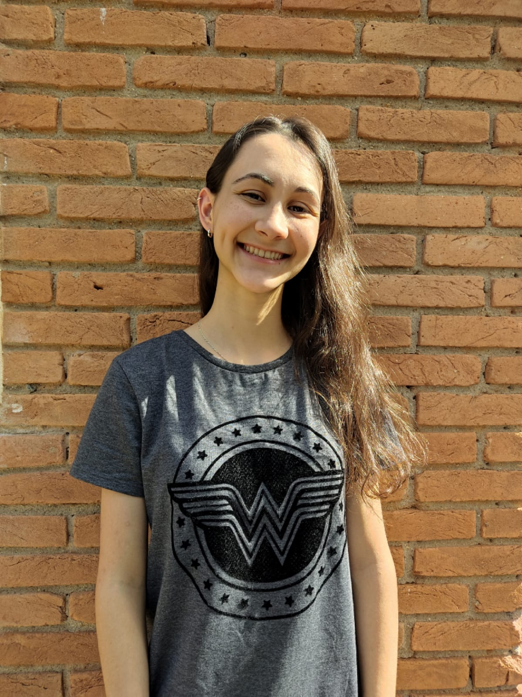

# Ana Carolina das Neves

## Introdução

  

    
  

  Sou formada em Análise e Desenvolvimento de Sistemas pela Fatec SJC Jessen Vidal, tendo concluído a faculdade em 2024. Desde cedo, a tecnologia sempre esteve presente na minha vida, passando meus dias jogando videogame e navegando na internet. Em 2019, ganhei um concurso promovido pelo Google chamado 'Change the Game', voltado para jovens mulheres entre 15 e 21 anos, com o objetivo de apoiar e incentivar a representatividade feminina no desenvolvimento de jogos. Essa conquista me proporcionou a oportunidade de realizar 14 cursos na plataforma Alura, todos relacionados à criação de jogos. Ao finalizar esses cursos no final de 2020, minha paixão pela programação se intensificou.

  Concluí meu estágio de um ano no INPE em julho de 2024, onde fiz parte da SEPEC, contribuindo para o desenvolvimento do 3PST, um sistema de cadastramento de projetos internos. Anteriormente, esse cadastro era feito por meio do Microsoft Access, mas transformamos esse sistema em uma aplicação web. Na equipe, foquei no back-end, utilizando tecnologias como Python com Flask, e também contribuí para o front-end com HTML, CSS e JavaScript, utilizando as bibliotecas do Flask, como Flask-WTF, para formulários e o JavaScript para auxiliar em algumas funções. Esta experiência foi significativa e ampliou ainda mais meu conhecimento na área.

## Contatos

 

## Principais Conhecimentos 💡
        

## 🖥️ Projetos 
