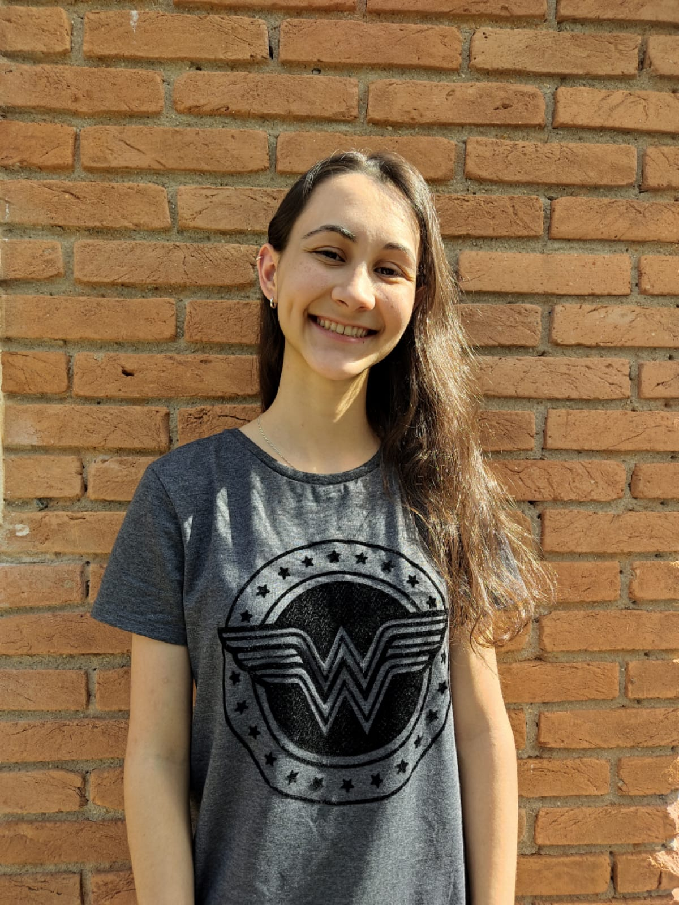

# Ana Carolina das Neves

## Introdução

  

    
  

  

    Sou formada em <b>Análise e Desenvolvimento de Sistemas</b> pela FATEC São José dos Campos – Prof. Jessen Vidal (2024). Minha relação com a tecnologia começou cedo, entre videogames e internet, o que despertou minha curiosidade por como as aplicações funcionam. Em 2019, fui vencedora do concurso <i>Change the Game</i> promovido pelo Google, voltado para incentivar a representatividade feminina no desenvolvimento de jogos. Essa conquista me possibilitou realizar 14 cursos na Alura, todos relacionados à criação de jogos, reforçando minha paixão pela programação.
  

  

    Durante a graduação, participei da metodologia <b>API (Aprendizagem por Projetos Integrados)</b>, desenvolvendo soluções reais para empresas parceiras com foco em metodologias ágeis, validação externa e aprendizado baseado em problemas reais. Tive contato com diversas tecnologias, como Java, Spring Boot, Vue.js, React, React Native, TypeScript, Docker, PostgreSQL e MySQL.
  

  

    Em 2023, iniciei estágio no <b>Instituto Nacional de Pesquisas Espaciais (INPE)</b>, atuando na SEPEC no desenvolvimento do sistema <b>3PST 2.0</b>. O projeto consistiu na migração de cadastros internos feitos em Microsoft Access para uma aplicação web moderna. Contribuí tanto no back-end, com <b>Python e Flask</b>, quanto no front-end, utilizando <b>HTML, CSS e JavaScript</b>, além de bibliotecas como Flask-WTF.
  

  

    Após essa experiência, trabalhei como <b>Desenvolvedora Júnior na Boostech Tecnologia</b>, prestando suporte a empresas do setor logístico. Minhas atividades incluíram correção de bugs, implementação de novas funcionalidades e manutenção de sistemas, utilizando <b>Laravel (PHP 7.4/8.3), Vue.js e PostgreSQL</b>, com versionamento no GitLab e ambiente Linux (Ubuntu/WSL).
  

  

    Atualmente, atuo como <b>Técnica de Soluções na Imagem Geosistemas</b>, realizando desenvolvimento e suporte de aplicações web geográficas com <b>ArcGIS Experience Builder Developer Edition (React)</b>; automação e manipulação de dados espaciais com <b>Python</b>; e apoio no levantamento de requisitos, manutenção de sistemas e suporte técnico.
  

## Cursos Complementares 🎓
- Formação **Explore React com JavaScript** – Alura (68h)  
  JSX, hooks, gerenciamento de estado, React Router e testes básicos.  

- Formação **Melhore sua aplicação React com testes automatizados** – Alura (56h)  
  Jest, Testing Library, testes de integração, mocks e TDD.  

- Formação **A partir do zero: iniciante em programação** – Alura (31h)  
  Lógica de programação e fundamentos da área.

## Contatos

 

## Principais Conhecimentos 💡
         

##  Projetos Acadêmicos

  Na Fatec de São José dos Campos, participei da metodologia API (Aprendizagem por Projetos Integrados), que integra teoria e prática desde o primeiro semestre. A API proporciona uma abordagem hands-on, com projetos semestrais divididos em 4 sprints de 21 dias cada.

  Durante cada sprint, desenvolvemos backlogs e wireframes para validação dos clientes, além de realizar o acompanhamento do progresso utilizando burndown charts. Cada membro da equipe desempenha um papel definido, seja como Master, Product Owner (PO) ou parte do Development Team.

  Os pilares da metodologia incluem Real Problem Based Learning (rPBL), Validação Externa e Mindset Ágil (Agile), garantindo que os projetos sejam conduzidos de forma eficiente e alinhados com as melhores práticas do mercado.

  <a href="https://github.com/AnaCarolinaNeves/portfolio/blob/main/fatec's%20projects/README.md" target="_blank">Clique aqui para visualizar os projetos realizados.</a>

## 🖥️ Projetos Pessoais

  Além dos projetos acadêmicos, dediquei-me a desenvolver projetos pessoais que abrangem diversas áreas do desenvolvimento de software. Trabalhei em projetos focados no desenvolvimento de front-end, back-end e integração entre ambos, explorando diferentes aspectos da criação de aplicações web.

  <a href="https://github.com/AnaCarolinaNeves/portfolio/blob/main/personal%20projects/README.md" target="_blank">Clique aqui para visualizar meus projetos pessoais.</a>

